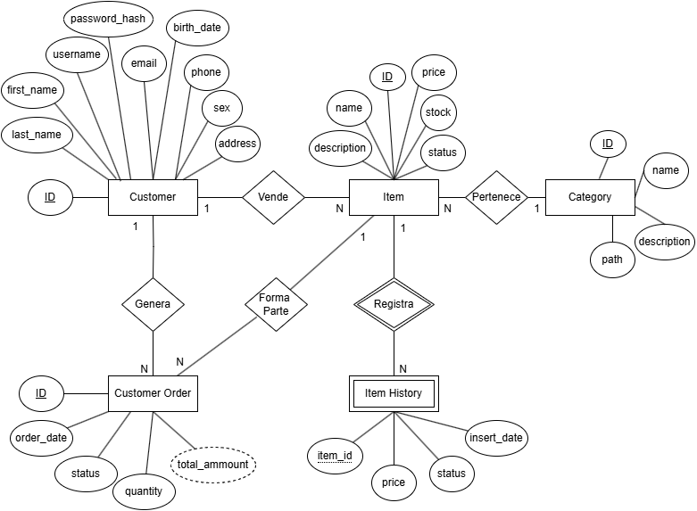

# ML-Challenge-SQL

Proyecto sobre la creacion de scripts SQL (tablas, consultas, etc) de un ecommerce, escrito en Oracle SQL.

## Estructura del proyecto

- **create_tables.sql**  
  Script para crear las tablas principales del modelo.

- **respuestas_negocio.sql**  
  Consultas SQL para poder respoder las situaciones mencionadas en el challenge.

- **Diagrama ecommerce.drawio**  
  Diagrama visual del modelo entidad-relación.

## Diagrama de la base

## Ejecución

1. **Crear las tablas**  
   Ejecuta `create_tables.sql` en tu base de datos Oracle.

2. **Ejecutar consultas de negocio**  
   > *Nota: para poder visualizar las consultas, es necesario poblar las tablas anteriormente creadas.*

   Ejecuta `respuestas_negocio.sql` para obtener los resultados requeridos y crear el procedimiento de carga histórica.

3. **Carga histórica automática**  
   El procedimiento `ITEM_HISTORY_DATA_LOAD` inserta un snapshot diario de precio y estado de cada ítem en `ITEM_HISTORY`.  
   Un job de Oracle Scheduler (`ITEM_HISTORY_DATA_LOAD_JOB`) puede ejecutarse automáticamente cada día a medianoche.